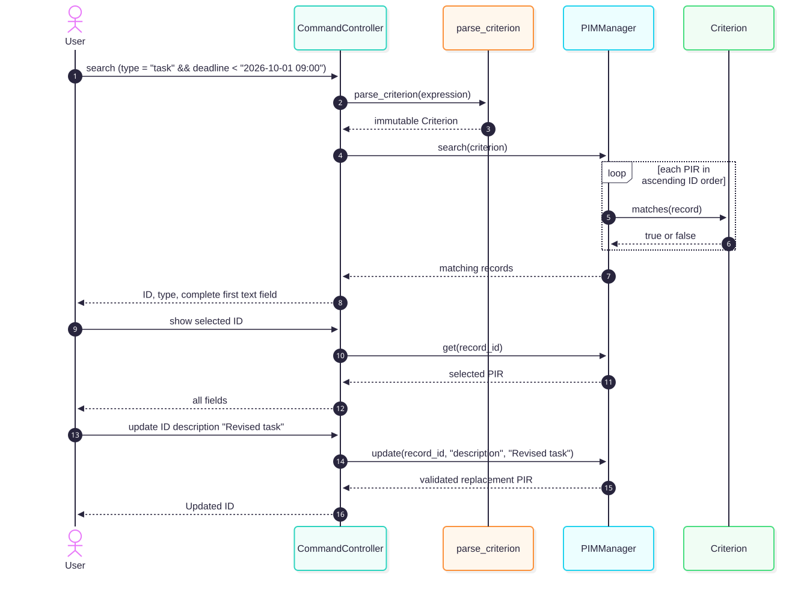

# PIM Design Document — WP02 Draft

**Course:** COMP3211 Software Engineering, Fall 2026 
**Project:** Command-line Personal Information Management system 
**Group number:** [To be supplied by the group] 
**Members and student IDs:** [To be supplied by the group] 
**Version/date:** WP02 draft 1.0, 2026-09-30

This is a proposed design baseline, not a report of implemented classes or tests. It implements the behavior in [SRS.md](../srs/SRS.md) and the product choices in [decisions.md](../../decisions.md). The companion [technical contract](TECHNICAL_CONTRACT.md) fixes additional parser, file, and CLI details for WP03. Class/module names here are design choices; the official Project Description requires the design explanations and diagrams, but does not prescribe these names.

## 1. Introduction

The PIM manages note, task, event, and contact records in one local command-line program. The design isolates user interaction, in-memory behavior, and `.pim` persistence so model unit tests can exercise records, CRUD, and search without terminal or file I/O. This directly supports the official requirement to place all model code in a separate `model` package. Only Python standard-library modules are used. The current `src/` tree is a scaffold; WP03 will implement the interfaces specified here.

## 2. Architecture and rationale

*Figure 1. High-level architecture. Editable source: [architecture.mmd](diagrams/architecture.mmd).*

The generic pattern is **layered, MVC-style separation**. The terminal presentation and command interpretation form the view/controller boundary in `controller`. `model` owns PIR types, validation, ID allocation, search parsing/evaluation, and the collection. `storage` is a file adapter for versioned `.pim` snapshots. `src/main.py` only creates the initial manager and controller. This keeps the model independent of terminal and file I/O, making the official model unit-test deliverable practical. A full GUI-oriented MVC framework would add unnecessary parts to this local CLI.

Arrows in Figure 1 show allowed calls and data movement: the user talks only to the CLI; the controller invokes model operations and the file adapter; storage constructs or reads validated model state; only storage touches the local `.pim` file. On load, storage returns a **new** manager and the controller swaps its active reference only after full validation. On failure the current manager is untouched. No reused third-party architectural component is assumed; the Python standard library supplies basic dates, JSON, paths, and file replacement.

## 3. Main code components and relationships

*Figure 2. Main classes, modules, and relationships. Editable source: [components.mmd](diagrams/components.mmd). The method labels are abbreviated here; exact types and exceptions are listed below.*

The class diagram uses **aggregation** from `PIMManager` to the four PIR classes because one manager holds many records. Dependency arrows show calls, not inheritance: the controller calls the manager, search parser, and storage; the manager evaluates `Criterion`; storage constructs a replacement manager. A `Criterion` interface is implemented by immutable type, text, time, AND, OR, and NOT nodes. The parser builds those nodes without evaluating input as Python code. No reverse dependency from `model` to `controller` or `storage` is allowed.

### 3.1 Record types and shared fields

All four records are frozen dataclasses. Each has a positive `id: int` and a read-only canonical `type: RecordType` property. Each constructor validates and trims accepted text in `__post_init__`; it rejects wrong field types, blank/multiline text, aware or non-minute datetimes, and invalid IDs with `ValidationError`. Normal creation still goes through the manager, which validates before allocating an ID. The data fields are:

| Class and constructor signature | Data fields | Return / possible exception |
|---|---|---|
| `Note(id: int, text: str) -> Note` | `text: str` | `Note`; `ValidationError` |
| `Task(id: int, description: str, deadline: datetime) -> Task` | `description: str`, `deadline: datetime` | `Task`; `ValidationError` |
| `Event(id: int, description: str, start_time: datetime, alarm_time: datetime) -> Event` | `description: str`, `start_time: datetime`, `alarm_time: datetime` | `Event`; `ValidationError` |
| `Contact(id: int, name: str, address: str, mobile_number: str) -> Contact` | `name: str`, `address: str`, `mobile_number: str` | `Contact`; `ValidationError` |

There are no other public or protected methods on these record classes beyond the generated field access and read-only `type` property. Accepted text is trimmed at the model boundary; dates are naive local values at minute precision. `mobile_number` remains text so `+` and leading zeros survive. Neither past times nor the ordering of event start and alarm are restricted. Duplicate field values across records are allowed.

### 3.2 Model manager and exceptions

`PIMManager` has `_records: dict[int, Record]` and `_next_id: int`. Both are private; `next_id` is a read-only property. The manager commits a new or replacement record only after all validation succeeds, and returns ID-ascending immutable tuples for list/search. All ID arguments are positive integers; Boolean IDs are invalid. Its public signatures are:

| Method signature | Return | Possible exception |
|---|---|---|
| `PIMManager() -> PIMManager` | Empty manager with next ID 1 | None |
| `next_id: int` | Current next ID | None |
| `create_note(text: str) -> Note` | New note | `ValidationError` |
| `create_task(description: str, deadline: str) -> Task` | New task | `ValidationError` |
| `create_event(description: str, start_time: str, alarm_time: str) -> Event` | New event | `ValidationError` |
| `create_contact(name: str, address: str, mobile_number: str) -> Contact` | New contact | `ValidationError` |
| `get(record_id: int) -> Record` | Selected PIR | `ValidationError`, `RecordNotFoundError` |
| `list_all(record_type: str \| None = None) -> tuple[Record, ...]` | All/filter matches, ID ascending | `ValidationError` |
| `update(record_id: int, field_name: str, value: str) -> Record` | Replacement PIR | `ValidationError`, `RecordNotFoundError` |
| `delete(record_id: int) -> None` | None | `ValidationError`, `RecordNotFoundError` |
| `search(criterion: Criterion) -> tuple[Record, ...]` | Matches, ID ascending | `ValidationError` for a non-criterion argument |
| `from_rows(rows: Sequence[Mapping[str, object]], file_next_id: int, previous_next_id: int) -> PIMManager` | Fully validated replacement manager | `ValidationError` |

`PIMError` is the common model exception. `ValidationError` covers invalid schema, field, time, or ID input; `RecordNotFoundError` covers an absent valid ID; `SearchSyntaxError` is a `ValidationError` for a malformed criterion. They identify the rejected input or failure category. No manager method performs terminal or file I/O. `from_rows` validates a complete snapshot without mutating the active manager, rejects duplicate/out-of-order IDs or invalid counters, and sets the new counter to `max(previous_next_id, file_next_id)`.

### 3.3 Time validation and search

| Public function or method | Return | Possible exception |
|---|---|---|
| `parse_local_time(value: str) -> datetime` | Naive local minute | `ValidationError` |
| `format_local_time(value: datetime) -> str` | Exact `YYYY-MM-DD HH:mm` | `ValidationError` |
| `parse_criterion(expression: str) -> Criterion` | Immutable criterion tree | `SearchSyntaxError` |
| `Criterion.matches(record: Record) -> bool` | Match result | None for valid criterion/record |

`Criterion` is an abstract base class, enabling `PIMManager.search` to reject non-criterion arguments with `ValidationError`. The six concrete criterion classes—`TypeCriterion(value: RecordType)`, `TextCriterion(field: TextField, needle: str)`, `TimeCriterion(field: TimeField, operator: Literal["<", ">", "="], value: datetime)`, `AndCriterion(left: Criterion, right: Criterion)`, `OrCriterion(left: Criterion, right: Criterion)`, and `NotCriterion(operand: Criterion)`—each expose `matches(record: Record) -> bool` with no expected exception for a parser-produced node and valid record. Their fields are listed in the constructor signatures. A valid absent field evaluates false, and `NotCriterion` inverts that result. Type and text comparisons ignore case; time comparisons use actual date/minute order.

These node constructors are also usable directly in model tests. Their `__post_init__` methods canonicalize valid type/field names and raise `ValidationError` for an invalid type/field, empty text needle, invalid time operator/value, or non-`Criterion` child. A text needle is not trimmed. Parser-specific quote validation occurs before construction; the parser translates node validation faults to `SearchSyntaxError`. This keeps parser-produced and directly constructed criteria subject to the same semantic rules.

The tokenizer recognizes quoted literals and only `\"` and `\\` escapes, field/type identifiers, comparison and Boolean operators, and parentheses. The parser checks the entire expression and creates the criterion tree before `PIMManager.search` evaluates any PIR. It uses recursive descent with parentheses, `!`, `&&`, then `||` precedence, not `eval()`. `parse_local_time` uses parsing plus round-trip formatting to enforce the exact zero-padded external syntax. The model performs this conversion even if the controller passes a valid-looking string, so model tests do not depend on the CLI.

### 3.4 Storage, controller, and entry point

| Public function or method | Return | Possible exception |
|---|---|---|
| `save_pim(manager: PIMManager, path: Path) -> None` | None | `PersistenceError` |
| `load_pim(path: Path, current_next_id: int) -> PIMManager` | New fully validated manager | `PersistenceError` |
| `CommandController.__init__(self, manager: PIMManager, working_directory: Path) -> None` | Initialized controller holding the active manager and working directory | `ValidationError` for invalid constructor inputs |
| `CommandController.run(input_stream: TextIO, output_stream: TextIO) -> None` | None at `exit` or EOF | I/O exceptions from the supplied streams may propagate; handled command errors are printed and do not escape |
| `main() -> None` | None | Unexpected setup/stream errors may propagate |

Storage owns UTF-8 JSON decoding/encoding, exact `format`/`version`/key checks, record serialization, and same-directory temporary-file replacement. It rejects malformed files and returns a new manager only after full validation. A failed save leaves an existing destination intact; a failed load leaves the current manager and its counter intact. `PersistenceError` names a safe category such as path, format, or I/O. The version 1 JSON schema and failure rules are fully specified in the technical contract.

The controller owns `_manager: PIMManager` and `_working_directory: Path`. It accepts the SRS command vocabulary, shows `pim> `, resolves relative paths, and turns expected model, storage, and `CommandSyntaxError` failures into `Error: CATEGORY: DETAIL` followed by another prompt. The fixed categories are `COMMAND`, `VALIDATION`, `NOT_FOUND`, `SEARCH`, `PATH`, `FORMAT`, and `IO`, mapped by exception type or storage failure category as specified in the technical contract. It formats complete record details and ID-ordered list/search summaries. It parses an ID token as positive decimal digits, handles `exit` and EOF, and never performs model validation in place of the model. `main()` only composes these objects and passes standard input/output. The explicit stream parameters permit CLI tests without patching global streams.

## 4. Search, select, and update example

*Figure 3. Example collaboration. Editable source: [search-update-sequence.mmd](diagrams/search-update-sequence.mmd).*

The user enters `search (type = "task" && deadline < "2026-10-01 09:00")`. The controller extracts the expression; `parse_criterion` defines a validated criterion tree; `PIMManager.search` executes it over all PIRs. The controller shows ascending-ID summaries. The user chooses an ID and requests full details with `show ID`, then changes one field with `update ID description "Revised task"`. The manager validates the new description and replaces only that task record. This diagram includes the course-requested criterion definition, search, selection, and update path. It shows only a successful path; invalid expressions stop before search, and failed updates leave the selected PIR unchanged.

## 5. Requirement allocation and design checks

| SRS IDs | Design owner |
|---|---|
| FR-01–FR-11 | Record classes, validation, manager creation and ID counter |
| FR-12–FR-15 | Controller command tokenizer and dispatch |
| FR-16–FR-17 | Manager one-field update |
| FR-18–FR-25 | Manager list/get/delete; controller rendering, help, session lifecycle |
| FR-26–FR-40 | Search tokenizer/parser, criterion nodes, manager evaluation, controller summaries |
| FR-41–FR-48 | Storage and manager restoration; controller reference swap and path resolution |
| FR-49–FR-50 | Controller error display and validation-before-commit in every mutating boundary |
| NFR-01–NFR-05 | Local CLI, Python version, standard-library imports, separate model and identifiable other packages |

The ranges are inclusive and allocate every FR-01–FR-50 and NFR-01–NFR-05. Before WP03 implementation, model tests should exercise each model rule through public methods; storage tests should cover a four-type round trip and malformed-file preservation; CLI checks should compare actual commands and output with the SRS. No test or coverage result is claimed at this design stage.
