# COMP3211 PIM End-to-End Delivery Plan

> **For Codex:** Execute the work packages in `docs/plans/work-packages/` in numerical order. Use multi-agent work only where the work package explicitly calls for independent review. Do not start a dependent package until its gate is recorded as passed.

**Goal:** Produce a complete, internally consistent COMP3211 PIM project and a submission-ready release candidate, leaving only the two human-recorded videos, verified member data, signatures, and final upload for the group.

**Architecture:** The product is a Python command-line application separated into `model`, `controller`, and `storage`. Requirements and technical contracts are frozen before implementation. One implementation conversation builds the code sequentially with tests; later conversations generate documents only from a verified code-freeze commit.

**Tech Stack:** Python standard library, `unittest`, Git/GitHub, Markdown source documents, PDF final documents, MP4 recordings.

---

## 1. Current state and immediate blockers

As of 2026-09-30:

- The private GitHub repository and project skeleton exist.
- There is no functional PIM implementation yet.
- There is no final SRS or design baseline.
- `decisions.md` still contains unresolved product rules.
- The original course PDF is no longer present at its earlier local path. Work Package 00 must restore it before any formal requirement claim is finalized.
- The Canvas group-registration deadline, 2026-09-28 09:00, has passed. A group member must confirm the real Canvas status; an Agent must not mark it complete without evidence.
- Final submission is due 2026-11-20 20:00.

## 2. Authority order

Every later conversation must resolve conflicts in this order:

1. Restored official 2026 Project Description PDF.
2. Course Lecture 04 SRS structure slides where the PDF refers to them.
3. Approved `decisions.md` for details the teacher leaves to the group.
4. Approved SRS requirements.
5. Approved technical contract and design.
6. Verified code-freeze commit and real test evidence.
7. Manuals, reports, slides, and scripts derived from the above.

The senior Jungle Game repository is a structural reference only. It is not an authority for the 2026 PIM functionality or submission rules.

## 3. Official baseline already extracted

The original PDF must still be restored and rechecked, but the prior page-by-page extraction established this baseline:

- One command-line PIM application.
- Java or Python is allowed; this group has selected Python.
- Product implementation uses only the selected language's standard library.
- Model code is in a separate package named `model`.
- Four PIR types: note, task, event, and contact with the fields stated in US2-US5.
- Modify, search, display one/all, delete, save `.pim`, and load `.pim`.
- Search covers type, text containment, time `<`, `>`, `=`, and combinations with `&&`, `||`, `!`.
- SRS: 6 points.
- Design Document: 5 points.
- Implementation and manuals/demo/coverage: 6 points.
- Model unit tests and line coverage: 4 points.
- Presentation: 4 points.
- System demo: MP4, at most 4 minutes.
- Presentation slides: PDF.
- Presentation recording: MP4, at most 5 minutes.
- Each member speaks at least 1 minute; identity card and face requirements apply.
- Requirements Coverage and model line-coverage reports belong in the submitted source-code root.
- Honour Declaration belongs in the ZIP root even if no GenAI was used; real GenAI use and contribution percentages must be declared.

## 4. Single source of truth

The following files progressively become authoritative:

| Stage | Authoritative file |
|---|---|
| Official intake | `docs/plans/official-requirements-matrix.md` |
| Product rules | `decisions.md` |
| Required behavior | `docs/srs/SRS.md` |
| Public interfaces | `docs/design/TECHNICAL_CONTRACT.md` |
| Final implementation | Commit SHA recorded in `docs/reports/code-freeze.md` |
| Traceability | `docs/reports/Requirements_Coverage.md` |
| Release contents | `submission/manifest.md` |

No downstream conversation may silently invent a different command, field, error rule, class, method, test result, or coverage number.

## 5. Work-package sequence

| WP | New conversation | Multi-agent use | Depends on | Main output | Gate |
|---|---|---|---|---|---|
| 00 | Official requirements and decision workshop | Yes, 3 read-only reviewers | None | Requirement matrix and frozen decisions | G0 |
| 01 | SRS | Yes, requirements/user/test reviewers | G0 | `SRS.md` and reviewed draft PDF | G1 |
| 02 | Architecture and technical contract | Two read-only design reviewers | G1 | Design draft, diagrams, stable APIs | G2 |
| 03 | Complete implementation and tests | No parallel coding | G2 | Full `src/` and `tests/` | G3 |
| 04 | Integration QA, coverage, and code freeze | Independent read-only audit first | G3 | Verified code, evidence, freeze SHA | G4 |
| 05 | Final documents and reports | Yes, disjoint document files | G4 | SRS/Design/manuals/reports | G5 |
| 06 | Presentation and video materials | Yes, slides and scripts may split | G5 | Presentation PDF and two recording scripts | G6 |
| 07 | Independent cross-artifact audit and repair | Yes, 3 read-only auditors | G6 | Resolved audit report | G7 |
| 08 | Release candidate and ZIP assembly | Single integrator | G7 | Pre-video release candidate and manifest | G8 |

Detailed instructions and copy-ready prompts are in [work-packages/README.md](work-packages/README.md).

## 6. Dependency graph

```mermaid
flowchart LR
    A[WP00 Requirements and decisions] --> B[WP01 SRS]
    B --> C[WP02 Design and APIs]
    C --> D[WP03 Code and tests]
    D --> E[WP04 QA and code freeze]
    E --> F[WP05 Final documents]
    F --> G[WP06 Presentation and scripts]
    G --> H[WP07 Independent audit]
    H --> I[WP08 Release candidate]
    I --> J[Human videos and declaration]
    J --> K[Final ZIP verification and upload]
```



## 7. Why code stays in one conversation

The record types, manager, search parser, persistence format, and CLI share field names and exception behavior. Parallel coding would save little time and creates a high risk that Agents invent incompatible APIs. WP03 therefore uses one implementation conversation and a strict sequence:

```text
record types
→ manager CRUD
→ pure search parser/evaluator
→ search integration
→ .pim persistence
→ CLI
→ acceptance tests
```

Multi-agent work is used for independent analysis and review, where different viewpoints improve quality without editing the same files.

## 8. Git and conversation rules

### Before every modifying conversation

```powershell
cd D:\comp3211\COMP3211-PIM
git status --short
git switch main
git pull --ff-only
git switch -c work/wpXX-short-name
```

### During the conversation

- Read the required upstream files first.
- Modify only the work package's file scope.
- Do not work concurrently in the same checkout with another modifying conversation.
- Read-only subagents may run in parallel.
- If true parallel editing is required, use separate Git worktrees.
- Record AI assistance in `submission/ai-use-log.md` once that file exists.

### At completion

```powershell
git diff --check
git status --short
```

Run every work-package-specific verification command, commit one coherent result, push the branch, and open a pull request. Merge it before starting a dependent work package.

Every completion report must give:

- files changed;
- requirements covered;
- exact verification commands and real results;
- commit SHA and PR URL if created;
- unresolved risks and the next gate status.

## 9. Evidence rules

Agents must never estimate or invent:

- number of tests or passed tests;
- line coverage;
- performance measurements;
- video duration;
- member names or student IDs;
- contribution percentages;
- signatures;
- whether Canvas registration is complete.

All such claims require actual output or human-provided facts.

## 10. Human input register

The project can be built before these items are supplied, but the final submission cannot be completed without them:

| Human input | Needed by |
|---|---|
| Restored official Project Description PDF | WP00 |
| Lecture 04 SRS structure slides, if exact structure is not otherwise available | WP01 |
| Canvas group status | WP00 |
| Group number, names, student IDs | WP05/WP06 |
| Actual contribution percentages | WP08 |
| Official Honour Declaration form | WP08 |
| Confirmed GenAI declaration and signatures | Human closeout |
| System Demo MP4 | Human closeout |
| Presentation Recording MP4 | Human closeout |

## 11. Suggested calendar

| Dates | Target |
|---|---|
| Sep 30-Oct 2 | WP00: restore official inputs and freeze decisions |
| Oct 3-5 | WP01: SRS baseline |
| Oct 6-8 | WP02: architecture and API contract |
| Oct 9-20 | WP03: complete code and tests |
| Oct 21-25 | WP04: QA, coverage, freeze |
| Oct 26-Nov 4 | WP05: final documents and reports |
| Nov 5-10 | WP06: slides and scripts |
| Nov 11-13 | WP07: independent audit and repairs |
| Nov 14-16 | WP08: release candidate |
| Nov 17-19 | Human recordings, declaration, clean-machine rehearsal |
| Nov 20 before 20:00 | Upload final ZIP |

## 12. Final submission layout

The numbered folders are a group convention, not an official naming requirement. `03_Implementation` is treated as the source-code root so both coverage reports sit in the required location.

```text
COMP3211_Group_Project.zip
├─ 01_SRS/
│  └─ SRS.pdf
├─ 02_Design/
│  └─ Design_Document.pdf
├─ 03_Implementation/
│  ├─ src/
│  ├─ tests/
│  ├─ tools/
│  ├─ README.md
│  ├─ Developer_Manual.pdf
│  ├─ User_Manual.pdf
│  ├─ Requirements_Coverage.pdf
│  └─ Test_Coverage.pdf
├─ 04_Demo/
│  └─ System_Demo.mp4
├─ 05_Presentation/
│  ├─ Presentation.pdf
│  └─ Presentation_Recording.mp4
└─ Honour_Declaration_for_Group_Project.pdf
```

## 13. Human closeout after WP08

1. Record the system demo from the exact frozen build and verify it is at most 4 minutes.
2. Record the group presentation and verify it is at most 5 minutes.
3. Ensure each member speaks at least 1 minute and identity/face requirements are met.
4. Confirm real contribution percentages and GenAI use.
5. Complete and sign the official Honour Declaration.
6. Insert the two MP4 files and declaration into the release-candidate directory.
7. Re-run WP08's final verification on the actual files.
8. Upload before 2026-11-20 20:00.

## 14. Definition of done

The project is ready for human recording only when:

- US1-US11 have verified working paths;
- all model unit tests run automatically and pass;
- real model line coverage is available;
- implementation has no third-party runtime imports;
- SRS, design, code, manuals, reports, slides, and scripts refer to the same commands, fields, classes, methods, and tests;
- every PDF has been rendered and visually checked;
- the release manifest lists every required artifact;
- there are no unresolved `TBD`, `TODO`, `PLACEHOLDER`, fake names, fake IDs, or invented metrics outside explicitly marked human-input fields.
